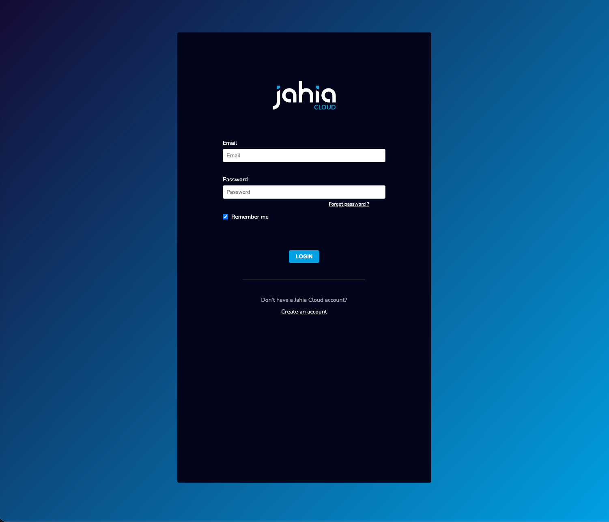
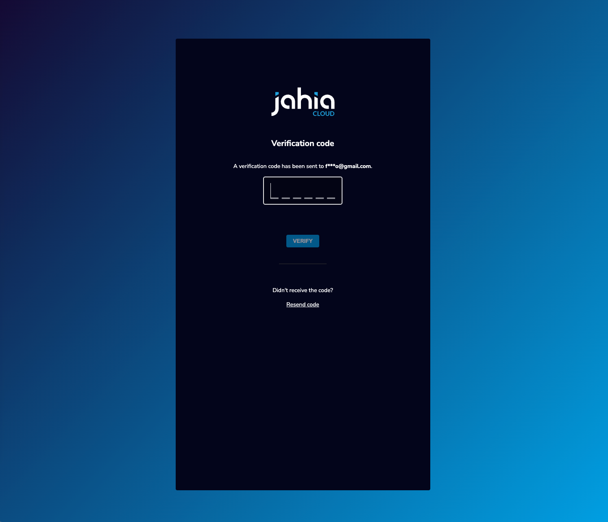

---
page:
  $path: /sites/academy/home/documentation/jahia/8_2/developer/authentication/configuring-multi-factor-authentication/document-area/upa-documentation
  jcr:title: User Password Authentication (UPA) Module - User Guide
  j:templateName: documentation
content:
  $subpath: document-area/content
publish: false
---

## Table of Contents
- [Scope](#scope)
- [Prerequisites](#prerequisites)
- [Installation & Configuration](#installation--configuration)
- [Terminology](#terminology)
- [User Authentication Flow](#user-authentication-flow)
- [Customization](#customization)
- [Troubleshooting](#troubleshooting)
- [Known Limitations](#known-limitations)
- [Contact and support](#contact-and-support)

## Scope

This module provides a basic user authentication flow for Jahia sites using a username/password combination followed by factor(s) verification.

:::warning
It is not meant to be a replacement for a full-fledged Identity Provider (IdP) solution: OpenId, SAML, etc. that you should preferably use instead.
:::

## Prerequisites

### System Requirements
- **Jahia 8.2.3** or higher
- **GraphQL DXM Provider** module (included in Jahia core)

### For Cluster Environments
If you're using a Jahia cluster, you must configure either **sticky sessions** or **distributed sessions** to ensure proper authentication handling.

### For MFA with Email Code Factor
- **SMTP server** must be configured and working in Jahia. More information can be found in the [Jahia documentation](https://academy.jahia.com/documentation/jahia-cms/jahia-8.2/system-administrator/administering-your-server/configuring-mail-settings/configuring-mail-server-settings).
- Users must have the **`j:email`** property set in their profile (their `jnt:user` node)

## Installation & Configuration

### 1. Install the Modules

Get the modules from the [Jahia Store](https://store.jahia.com/module/user-password-authentication).

1. **Deploy the API module** (`user-password-authentication-api-X.Y.Z.jar`)
   - Install via Jahia Module Manager or provisioning, more information can be found in the [Jahia documentation](https://academy.jahia.com/tutorials-get-started/java-developers/installing-a-module)
   - ⚠️ **Important**: Once enabled, this module will override the default login URL for all sites on your platform
   
2. **Deploy the UI module** (`user-password-authentication-ui-X.Y.Z.tgz`)
   - Install the module
   - Enable it on your site(s)

### 2. Setup

To ensure that users are properly redirected to your login page when accessing protected resources, you need to configure a login URL provider. You have three options:

#### Option A: Use the Embedded Login URL Provider (Recommended)

Navigate to **Tools → OSGi Console → OSGi → Configuration** and set the `loginUrl` parameter of the `org.jahia.modules.upa` configuration to the URL of the page containing your UPA login form (e.g., `/sites/mySite/login.html`).
Notes:
  - This page must be accessible without authentication
  - The URL **must** include the site key for proper email template resolution (required when using the UI module's default template or custom templates)
  - If the value is empty or blank, the login URL provider will be disabled

For all configuration options and default values, see the [default configuration file](../api/src/main/resources/META-INF/configurations/org.jahia.modules.upa.mfa.cfg).

#### Option B: Use the community _Site Settings - Customize Error Pages_ module

Install and configure the [Site Settings - Customize Error Pages](https://store.jahia.com/contents/modules-repository/org/jahia/community/site-settings-error-pages.html) module to define custom error pages per site, including the login page.

#### Option C: Build Your Custom Login URL Provider

For advanced use cases, you can implement your own custom `LoginUrlProvider` to have complete control over the login URL resolution logic.

#### Create the Login Page

Once you've configured your login URL provider, create the login page:

1. In **Page Builder**, create a new page at the URL you configured (e.g., `/sites/mySite/login.html`). Optionally, you can configure a vanity URL for that login page matching the configured URL.
2. Add the **UPA Authentication** component (`upaui:authentication`) to the page
3. If needed, edit the component where you can update:
   - the logo image
   - the field labels (email, password, verification code)
   - Additional HTML content (e.g., password reset link, registration link)
4. **Publish** the page
5. Ensure the page is accessible without authentication (verify in incognito/private browsing)

### 3. Secure Your Platform

⚠️ **Security Note**: The standard `/cms/login` endpoint remains accessible by default and **bypasses** the UPA authentication flow. For production environments, block access to this endpoint at your reverse proxy level (HAProxy, Apache, nginx, etc.).

## Terminology

Multi-factor authentication in UPA follows a two-step process for each factor:

### Prepare  
The preparation step generates and delivers the authentication challenge to the user. This step prepares everything needed for the user to receive and respond to the authentication challenge.

For example, for the email code factor, it generates a random code and sends it via email.

### Verify  
The verification step validates the user's response to the challenge.

For example, for the email code factor, it checks if the code entered by the user matches the one that was sent by email.

## User Authentication Flow

Once configured, your users will experience the following authentication flow:

1. **Accessing Protected Content**: When a user tries to access a protected resource, they are automatically redirected to the login page you configured
2. **Entering Credentials**: The user enters their username/email and password
   
3. **MFA Email code Verification** (if enabled): 
   - The user receives a verification code via email
   - The user enters the code in the verification form
   
4. **Access Granted**: Upon successful authentication, the user is redirected to the originally requested resource

**Note**: Users must have the `j:email` property set in their profile for MFA to work.

## Customization

### Custom Email Template

You can customize the MFA verification code email by creating a custom view (`mailCodeView` with a higher priority) for the `upa:mfaMailCode` node type.

**Important considerations:**
- Make sure to use the `{{CODE}}` placeholder for the verification code
- Use inline CSS for styling (email clients have limited CSS support)
- Host images on publicly accessible URLs
- See [Can I email](https://www.caniemail.com/) for HTML/CSS compatibility in email clients

**Example:** See [mfa-custom-mail-code-template](../test-modules/mfa-custom-mail-code-template/) module.

### Building a Custom UI

The only required UPA module is the API module (`user-password-authentication-api`), which provides GraphQL APIs for authentication and MFA flows. You can create your own custom UI that uses these APIs instead of using the out-of-the-box UI module.

The APIs are available at `/modules/graphql-dxm-provider/tools/graphql-workspace.jsp` (go to **Tools → Jahia GraphQL Core Provider : graphql-workspace**) and can be used to build custom authentication flows. More information about GraphQL can be found in the [Jahia documentation](https://academy.jahia.com/documentation/jahia-cms/jahia-8.2/developer/working-with-our-apis/graphql-api/using-graphql-to-perform-queries).

To create a custom UI, copy (or fork) the [UI module](../ui/) and customize it as needed. 

### Creating a Custom MFA Factor

⚠️ **Experimental Feature**: This feature is subject to change in future releases.

You can implement custom MFA factors (e.g., SMS, TOTP, biometric) by implementing the `MfaFactorProvider` interface.

**Example:** See [mfa-custom-factor](../test-modules/mfa-custom-factor/) module.

## Troubleshooting

### Login Page Not Displayed
- Verify the `loginUrl` is correctly configured in OSGi configuration   
- Ensure the login page exists and is published
- Check that the page is accessible without authentication

### MFA Code Not Received
- Verify SMTP settings in Jahia configuration
- Check that users have the `j:email` property set
- Review Jahia logs for mail sending errors

### Users Getting Locked Out
- Check the `maxAuthFailuresBeforeLock` configuration
- Users are temporarily suspended for `mfaUserTemporarySuspensionSeconds` after exceeding failed attempts
- In cluster environments: failed attempts are counted per node (see Known Limitations)

### Redirect Issues After Login
- Verify the target URL is accessible to the authenticated user
- Check for session configuration issues in cluster environments

## Known Limitations

### Failed Attempts in Cluster Environments
The maximum number of failed authentication attempts is : `((T - 1) x N) + 1` with:
- `T`: number of tries configured
- `N`: number of jahia nodes

For example, with 3 nodes and 5 tries configured, a user could, theoretically, get locked on their 13th attempt.

### Global login URL
The login URL is global and shared across all sites.
If you set the `loginUrl` in the configuration, visitors of all sites will be redirected to this URL when getting a 401 page. The Login URL Provider embedded in this module applies to the whole platform.

### Multiple Login URL Providers

If another module already defines a login URL provider, the UPA module will not work as expected.
You should have only one custom login URL provider enabled at a time.

### Login Page State Management
Directly accessing the login page URL will display the login form without redirect handling. Users should access protected resources and be redirected to the login page automatically.

### Legacy Login Endpoint
The `/cms/login` endpoint remains functional and **must be blocked** at the infrastructure level for complete security.

## Contact and support
For any questions or issues, please [contact the Jahia Support](https://support.jahia.com/secure/Dashboard.jspa).
